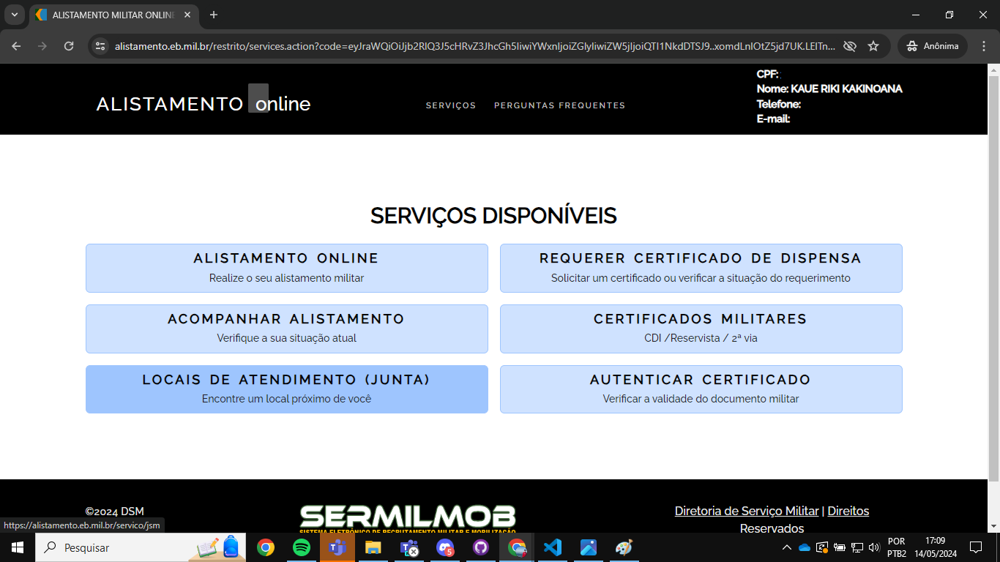
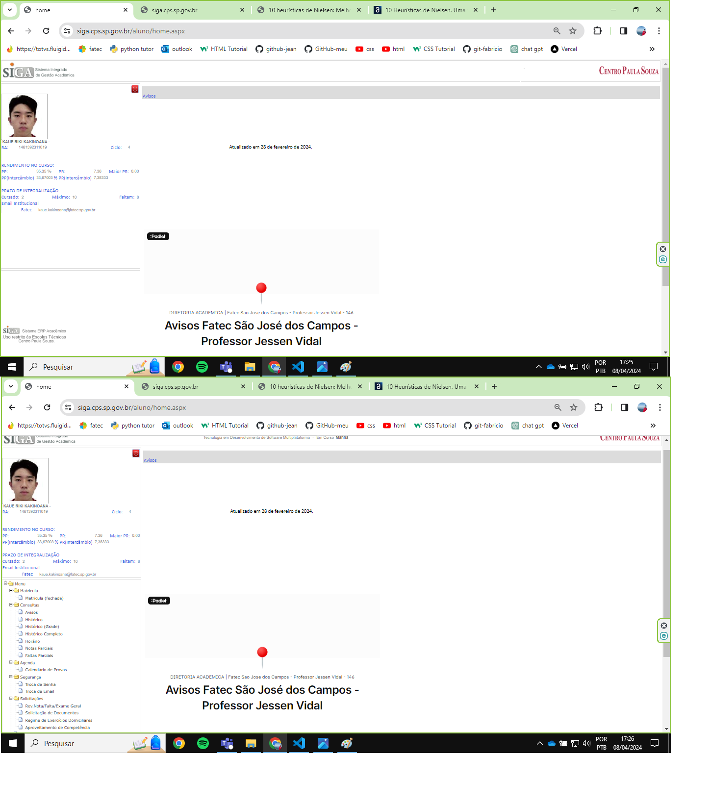
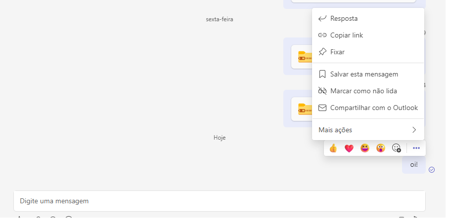

<h1>Trabalho das heurísticas da matéria de Interação Humano Computador do professor Bertoti</h1>

<h2>Falta da visibilidade do status, entrando na heurística 1(Visibilidade do Status do sistema)</h2>

<h2>Após o login feito não há nenhum botão de logout, entrando na heurística 4 (Consistência e padronização)</h2>

<h2>Falta da padronuzação da barra lateral, onde em uma tela não possui nada na barra lateral e outra tela há várias opções, entrando na heurística 4 (Consistência e padronização)</h2>

<h2>Depois que é enviada uma mensagem não é possível editar nem apagá-la, entrando na heurística 5(Prevenção de erros)</h2>